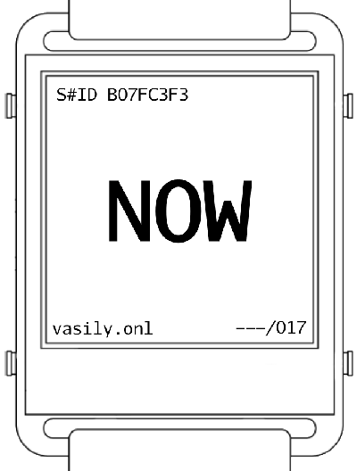

# NOW

"NOW" is an artistic investigation of time, a universally familiar and profoundly enigmatic concept. Through a series of 17 unique timepieces, this project invites viewers to question and reflect on their perception and experience of time. Each watch in this collection offers a distinct interpretation, challenging traditional notions and encouraging a deeper awareness of how we experience the passage of moments.

Time is a constant partner in our lives, yet it becomes less fundamental the more we question it.  Scientific theories and philosophical inquiries alike continue to probe its mysterious dimensions, revealing complexities that resist simple understanding. "NOW" delves into these complexities by presenting time through various lenses—mortality, balance, perception, recursion, memory, and beyond. This series seeks to unravel the intricate tissue of time, examining its role as both object and subject and presenting it as an active participant in the human experience.

In exploring these multifaceted interpretations, "NOW" prompts us to consider time not merely as a linear dimension but as a dynamic force that shapes and is shaped by our consciousness. It invites viewers to look beyond the obvious, to peer through the zero, and see the world anew.

---

The "NOW" series consists of 17 watches, each representing a unique facet of time. The decision to create 17 pieces is intentional. As a prime number, 17 is indivisible by any other number except itself and one, symbolizing uniqueness and integrity. This mirrors the nature of time—an indivisible continuum that, despite its universal presence, remains fundamentally unique in each moment we experience.

